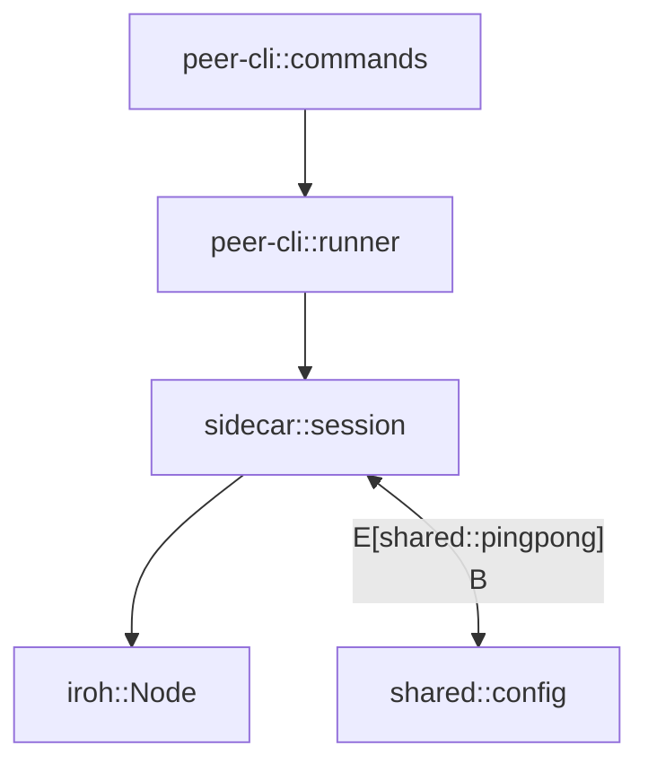

# Design Document

## Overview
`peer-ping-pong` は Rust cargo workspace 上で動作する最小機能の P2P 疎通検証ツールである。`peer-cli` がリスナー/ダイヤル両モードを持ち、`shared` crate が定義するメッセージフォーマットを `sidecar` crate の iroh ラッパー経由で送受信する。Bloom や Unity を介さず、直接指定した Multiaddr だけで接続確立から `ping/pong` 往復、RTT 計測までを完結させる。

## Steering Document Alignment

### Technical Standards (tech.md)
- Rust 1.81 + cargo workspace を前提とし、`sidecar`/`shared`/`peer-cli` を独立 crate として配置する。
- iroh を Rust サイドカー側でラップし、Noise ハンドシェイクやメトリクス送出など低レイヤを担当させる方針を踏襲する。
- OpenTelemetry や JSON ログといった可観測性の下地を用意し、将来的に Bloom ダッシュボードへ接続できるよう JSON 出力を採用する。

### Project Structure (structure.md)
- ルート `Cargo.toml` を workspace とし、`rust/crates/{sidecar,shared,peer-cli}`、`rust/xtask` をメンバー登録する。
- `shared` crate に MessagePack/Noise 関連型を置き、`sidecar` と `peer-cli` からのみ参照する。
- CLI は `rust/crates/peer-cli/src/main.rs` に配置し、ワンファイルで完結しないよう `command/`, `runner/` などサブモジュールへ責務を分割する。

## Code Reuse Analysis

### Existing Components to Leverage
- **既存 `src/main.rs`**: スケルトンのみ。今後 `rust/crates/sidecar` の `main.rs` として移設し、CLI とは分離する。
- **cargo workspace 構成**: 現在は未整備。`Cargo.lock` を再利用しつつマルチ crate に展開する。

### Integration Points
- **iroh**: `sidecar` での P2P 接続に使用。既存依存はないがライブラリとして組み込む。
- **OpenSSL/Noise ライブラリ**: 必要に応じて `sidecar` で使用し、`shared` の鍵管理と連携する。

## Architecture

ワークスペース内の 3 クレートが疎結合で役割分担する。

- `shared`: メッセージ型、鍵管理、設定値のシリアライズを担当。
- `sidecar`: iroh ラッパーとしてノード初期化、Noise ハンドシェイク、ストリーム送受信を行う。
- `peer-cli`: Clap ベースの CLI。`listen`/`dial` コマンドを提供し、`sidecar` の API を呼び出してログと JSON を出力する。



### Modular Design Principles
- 単一責務: CLI コマンド解析、セッション制御、プロトコル定義を別モジュールに分離する。
- コンポーネント分離: iroh 依存を `sidecar` に閉じ込め、CLI からは抽象化されたトレイト越しに利用する。
- サービス層分離: ハンドシェイクや ping ループは `sidecar::session::PeerSession` に集約し、CLI は結果を表示するだけにする。
- ユーティリティ分割: `shared::keypair`, `shared::multiaddr` など再利用可能なヘルパーを crate 内に用意する。

## Components and Interfaces

### Component 1: `shared::pingpong`
- **Purpose:** `PingMessage`, `PongMessage`, `RttReport` などのデータ構造と MessagePack シリアライザを提供。
- **Interfaces:**
  - `PingMessage::new(seq: u32, timestamp: Instant) -> Self`
  - `serialize_ping(&PingMessage) -> Vec<u8>` / `deserialize_ping(&[u8]) -> Result<PingMessage>`
  - `RttReport::from_ping_pong(ping: &PingMessage, pong: &PongMessage) -> RttReport`
- **Dependencies:** `rmp-serde`, `chrono` などシリアライズ系クレート。
- **Reuses:** 将来 Bloom からも使えるよう、プロトコルを共通化する。

### Component 2: `sidecar::session::PeerSession`
- **Purpose:** iroh ノードの初期化、Noise ハンドシェイク、`ping/pong` 送受信を抽象化。
- **Interfaces:**
  - `PeerSession::listen(cfg: SessionConfig) -> Result<(PeerSession, Multiaddr)>`
  - `PeerSession::dial(cfg: SessionConfig, peer: Multiaddr) -> Result<PeerSession>`
  - `PeerSession::send_ping(&mut self, PingMessage) -> Result<()>`
  - `PeerSession::recv_message(&mut self) -> Result<PingPongEvent>`
- **Dependencies:** `iroh`, `tokio`, `shared::pingpong`, `shared::config`。
- **Reuses:** `shared` の MessagePack 型を利用し、CLI への公開 API をトレイトでラップする。

### Component 3: `peer-cli::runner`
- **Purpose:** Clap で解析したサブコマンドを実行し、`PeerSession` と連携。
- **Interfaces:**
  - `run_listen(args: ListenArgs) -> anyhow::Result<()>`
  - `run_dial(args: DialArgs) -> anyhow::Result<()>`
  - `print_multiaddr(addr: &Multiaddr)`
  - `print_rtt(report: &RttReport)`
- **Dependencies:** `clap`, `serde_json`, `sidecar::session`, `shared::pingpong`。
- **Reuses:** `shared` の構造体を JSON に変換して出力する。

## Data Models

### `SessionConfig`
```
#[derive(Clone, Debug)]
pub struct SessionConfig {
    pub listen_addr: SocketAddr,
    pub keypair: Keypair,
    pub max_retries: u8,
    pub retry_backoff_ms: u64,
}
```

### `PingMessage`
```
#[derive(Serialize, Deserialize, Clone)]
pub struct PingMessage {
    pub sequence: u32,
    pub sent_at: DateTime<Utc>,
}
```

### `PongMessage`
```
#[derive(Serialize, Deserialize, Clone)]
pub struct PongMessage {
    pub sequence: u32,
    pub sent_at: DateTime<Utc>,
    pub received_ping_at: DateTime<Utc>,
}
```

### `RttReport`
```
#[derive(Serialize, Deserialize, Clone)]
pub struct RttReport {
    pub sequence: u32,
    pub rtt_ms: f64,
    pub attempts: u8,
}
```

## Error Handling

### Error Scenario 1: ハンドシェイク失敗
- **Handling:** `PeerSession::dial` が `PeerError::HandshakeTimeout` を返し、CLI 側でバックオフ付き再試行を実行。
- **User Impact:** CLI 標準出力に警告ログと再試行中メッセージ、最終的に失敗した場合は非ゼロ終了コード。

### Error Scenario 2: `pong` 未到達
- **Handling:** 3 秒以内に `PongMessage` が受信できなければ `PeerSession` が `PeerError::PingTimeout` を返し、CLI がエラーメッセージと再試行回数を表示。
- **User Impact:** JSON 出力に `{ "error": "ping_timeout" }` を追加し、ユーザーが即座に問題を把握できる。

### Error Scenario 3: CLI 引数不正
- **Handling:** Clap のバリデーションで `--addr` や `--peer` の形式を検証し、失敗時にはヘルプを表示。
- **User Impact:** 標準エラーにヘルプと使用例が表示され、プロセスは終了コード 2 で終わる。

## Testing Strategy

### Unit Testing
- `shared::pingpong` のシリアライズ/デシリアライズ、`RttReport` 計算ロジックをテストする。
- `sidecar::session` の内部ロジックはモックトランスポートを用意してハンドシェイク・タイムアウト分岐を検証する。

### Integration Testing
- `cargo test -p peer-cli -- --ignored` で 2 つの iroh ノードをローカルで起動し、`listen`/`dial` → `ping/pong` までのシナリオを e2e で実行する。
- `xtask` で GitHub Actions 用の統合テストコマンドを用意し、CI 上で `127.0.0.1` ポートを使ったシナリオテストを走らせる。

### End-to-End Testing
- ローカルマシンで 2 つの CLI を手動起動し、Multiaddr 表示・コピペ・RTT JSON 出力を人手検証。
- 将来的に別ホストを使った遠隔テスト手順を `docs/protocol/ping-pong.md` に追加し、複数ネットワーク透過性を確認する。
