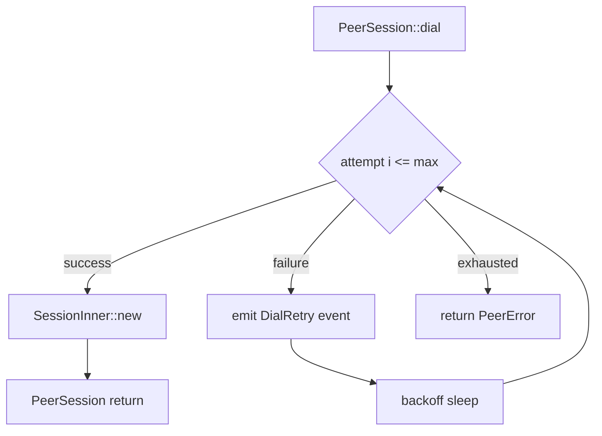

# Design Document

## Overview

PeerSession の `dial` ワークフローに再試行制御を導入し、UDP 接続確立からハンドシェイクまでを `SessionConfig::max_retries` と `retry_backoff_ms` に基づいて制御する。再試行時には構造化イベント `PeerEvent::DialRetry` を発行し、CLI およびログ出力が試行状況を可視化できるようにする。同時に RTT 計測ロジックを複数試行へ対応させ、成功試行の結果を反映する。

## Steering Document Alignment

### Technical Standards (tech.md)
- Tokio ランタイムと既存の非同期スタックを継続利用し、新規依存を追加しない。
- MessagePack ベースのメッセージ構造や iroh への抽象化を変更せず、sidecar crate 内で完結する。
- OpenTelemetry 連携や既存ロギング方針に沿って構造化ログ／イベントを追加する。

### Project Structure (structure.md)
- 変更対象は `rust/crates/sidecar/src/session.rs` と関連する `tests/session_tests.rs`、および CLI コマンド `rust/crates/peer-cli/src/commands/dial.rs`。既存のモジュール境界に合わせてセッション層へリトライ制御を追加し、CLI はイベント購読のみ拡張する。
- 新規ユーティリティが必要な場合は `session.rs` 内に private モジュールとして配置し、単一責務を保つ。

## Code Reuse Analysis

### Existing Components to Leverage
- **`SessionConfig`**: `max_retries` と `retry_backoff_ms` を既存フィールドから読み出し、後方互換のまま利用する。
- **`PeerSession`**: 既存の `dial` 実装を基礎に、接続試行ロジックのみループ化する。
- **`PeerEvent`**: enum を拡張し、CLI／テストで既存のイベント処理フローを再利用する。
- **`PeerEventReceiver` (CLI 側)**: 既存のイベントループにログ行追加するだけで可視化が可能。

### Integration Points
- **`peer-cli dial` コマンド**: 新しい `PeerEvent::DialRetry` をハンドリングし、人間向けメッセージと JSON ログを出力する。
- **統合テスト (`session_tests.rs`)**: 遅延リスナー・失敗シナリオを既存テストパターンに追加し、retry フローを検証する。
- **ドキュメント (`docs/cli/dial.md` など)**: 受け入れ条件に基づいて追記する。

## Architecture

再試行制御は `PeerSession::dial` 内に閉じ込め、接続試行を行う非公開関数 `attempt_connect` を呼び出すループで実装する。ループは以下を行う：
1. ソケットバインドおよび `connect` を実施。
2. 成功したら `SessionInner` を構築して終了。
3. 失敗した場合、リトライ可能か判定し、イベント／ログを発行。
4. 次の試行まで `retry_backoff_ms` を待機。



### Modular Design Principles
- `attempt_connect` はソケット準備と `connect` 実行に限定し、副作用を明確化する。
- `record_retry_event` ヘルパーでログとイベント発行を共通化する。
- RTT 計測は成功試行のメタデータを引き継ぐよう、`SessionInner` に成功試行番号を保持する。

## Components and Interfaces

### Component 1: `RetryingDialer`
- **Purpose:** `SessionConfig` を元に接続試行をループ制御する。
- **Interfaces:** private 関数 `async fn retry_dial(config, peer_addr) -> Result<(Arc<UdpSocket>, SocketAddr, u8), PeerError>`。
- **Dependencies:** Tokio の `sleep`, `Instant`; 既存の `map_io_error`。
- **Reuses:** 現行 `dial` 実装内のソケット生成／接続コード。

### Component 2: `PeerEvent::DialRetry`
- **Purpose:** 再試行情報を CLI や監視系へ通知する。
- **Interfaces:** `PeerEvent::DialRetry { peer: PeerAddress, attempt: u8, max_retries: u8, backoff_ms: u64, error: PeerErrorKind }`（新 Variant）。
- **Dependencies:** `PeerAddress`, `PeerError`（シリアライズ用に `PeerErrorKind` を追加）。
- **Reuses:** 既存のイベント配信チャンネル。

### Component 3: CLI Dial Event Handler
- **Purpose:** 再試行イベントを表示し、最後の成功メトリクスへ反映する。
- **Interfaces:** `match` 文に `PeerEvent::DialRetry` 分岐を追加。
- **Dependencies:** `tracing`／`indicatif` 等の既存ログ機構。
- **Reuses:** 現在の `PeerEvent` ループ。

## Data Models

### `PeerEvent::DialRetry`
```
struct DialRetryEvent {
    peer: PeerAddress,
    attempt: u8,
    max_retries: u8,
    backoff_ms: u64,
    error: PeerErrorKind,
    elapsed_ms: u128,
}
```
- `attempt` は 1-origin。`elapsed_ms` で開始からの経過時間を追跡。
- `PeerErrorKind` は既存 `PeerError` を列挙体へマッピングしてロギングを容易にする。

### Session Attempt Metadata
```
struct AttemptState {
    attempts: AtomicU8,
    last_success_attempt: AtomicU8,
}
```
- RTT 計測時に `last_success_attempt` を参照し、`RttReport` へ渡す。

## Error Handling

### Error Scenarios
1. **非回復性エラー (認証失敗・InvalidMultiaddr):**
   - **Handling:** 即座にエラー返却。再試行せず、`DialRetry` も発行しない。
   - **User Impact:** CLI に単回失敗として表示。
2. **ソケット確立失敗 (AddressInUse, PermissionDenied):**
   - **Handling:** エラーをラップして即時返却。設定の見直しが必要なため、リトライしない。
   - **User Impact:** エラーメッセージに原因を表示。
3. **接続拒否・タイムアウト:**
   - **Handling:** `DialRetry` を発行し、指定バックオフで再試行。全回数失敗で最終エラーを保持し返却。
   - **User Impact:** CLI が再試行ログを表示し、失敗時は総試行回数と最後のエラーを報告。

## Testing Strategy

### Unit Testing
- `retry_dial` のループ制御を Tokio テストで検証し、バックオフ計算と再試行回数が期待通りであることを確認する。
- `PeerEvent::DialRetry` のシリアライズ／ログ整形をテストする。

### Integration Testing
- 既存の `session_tests.rs` に遅延リスナーケースを追加し、初回拒否後に成功するシナリオを検証する。
- 全試行失敗シナリオを追加し、最終エラーと総試行回数が報告されることを確認する。

### End-to-End Testing
- `peer-cli dial` コマンドを統合テスト（tokio::test + CLI runner）で実行し、`--max-retries` と `--retry-backoff-ms` が CLI 出力に反映されることを確認する。
- ドキュメント更新後、`mdbook test`（想定）やリンクチェッカで記述整合性を検証する。
