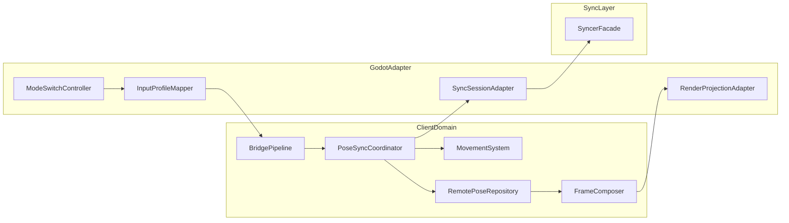
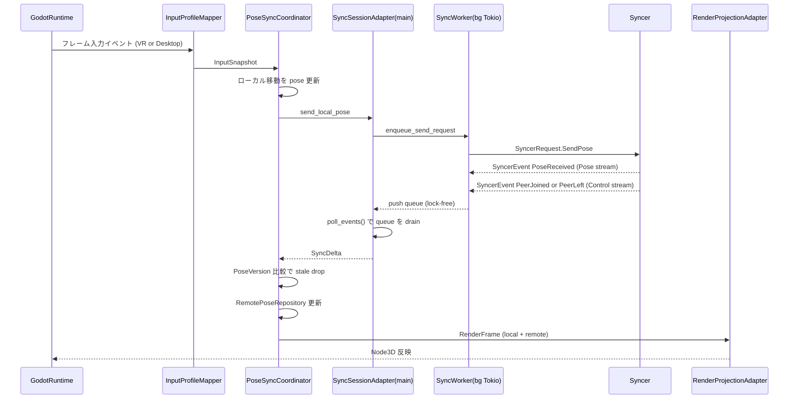
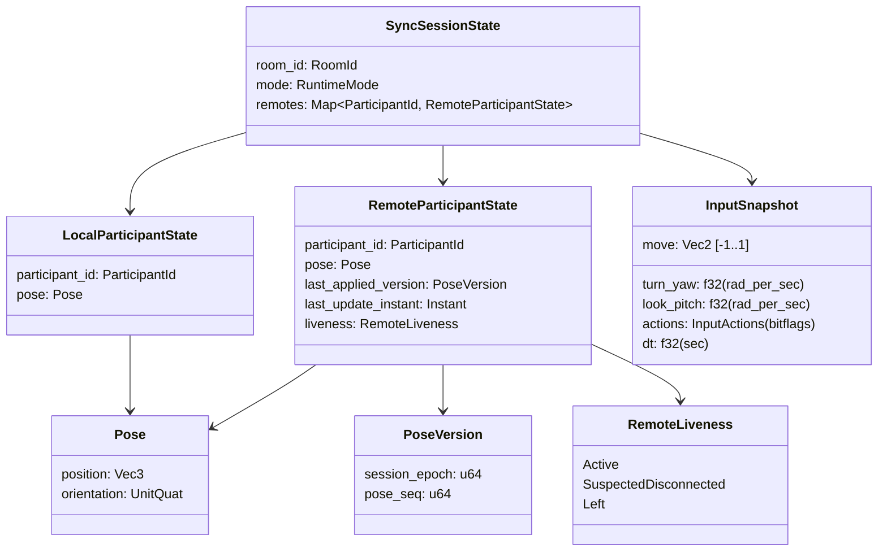

# Technical Design: client-pose-sync-vertical-slice

## Overview

本機能は、既存の `client/domain` と `client/godot-adapter` に対して、`syncer` を
統合し、2 participant 間の remote pose 同期を最小縦スライスで成立させる。
対象ユーザーはクライアント開発者であり、VR 実行と非VRデバッグの両方で再現可能な
同期検証経路を持つことを目的とする。

本設計は既存の Ports & Adapters 境界を維持し、Domain を Godot 非依存のまま拡張する。
具体的には、Domain に同期セッションと remote pose 状態を追加し、Adapter 側で
VR コントローラー入力および Desktop 入力（WASD + マウス）を共通入力契約へ
正規化する。さらに unordered/unreliable 配送を前提に、remote pose の「最新」は
`PoseVersion { session_epoch, pose_seq }` の辞書順比較で定義する。
また、同期イベントは論理的に `Control stream` と `Pose stream` に分離し、
イベント種別ごとに配送契約を明示する。

### Goals

- 2 participant 間の pose 送受信と remote pose 描画反映を成立させる
- peer join/leave に追従する remote 状態管理を確立する
- VR/desktop の2モード入力を共通契約へ正規化して同期送信に接続する
- 同期失敗時に段階別の原因追跡ができる観測性を提供する

### Non-Goals

- 音声同期（キャプチャ・再生・配信）
- Bloom 本番シグナリング配線
- 本番運用向け NAT traversal 最適化

## Architecture

### Existing Architecture Analysis

- 既存クライアントは `BridgePipeline -> RuntimeBridgeAdapter -> CoreEcs` の単一路で
  フレーム更新される。
- `syncer` は独立ライブラリとして完成度が高いが、client 側から未参照である。
- `GodotInputPort` は現状プレースホルダ変換であり、実入力を Domain 意味論へ落としていない。
- XR 初期化は lightweight API 制約を返す実装で、非VR fallback を前提とした設計が必要。

### Architecture Pattern & Boundary Map



**Architecture Integration**:

- Selected pattern: 既存 Hexagonal の拡張（Domain に同期・状態、Adapter に入力/外部接続を配置）
- Domain/feature boundaries:
  - Domain: pose 状態、peer 状態、モード非依存の入力解釈
  - Adapter: Godot 入力取得、XR/desktop モード選択、syncer 実体接続
- Logical streams:
  - Control stream: reliable/ordered（`PeerJoined` / `PeerLeft` / room ack / capability）
  - Pose stream: unordered + partial reliability（pose snapshots）
- Existing patterns preserved:
  - Godot 型を Domain に持ち込まない
  - `InputPort` / `OutputPort` で入出力境界を維持
- New components rationale:
  - `PoseSyncCoordinator`: 同期イベントとローカル入力の統合更新点
  - `SyncSessionAdapter`: syncer との差分吸収
  - `InputProfileMapper`: VR/Desktop の統一入力契約
- Steering compliance:
  - `docs/steering/tech.md` の境界設計、tracing 方針、同期分離方針を維持

### Technology Stack

| Layer | Choice / Version | Role in Feature | Notes |
|-------|------------------|-----------------|-------|
| Client Domain | Rust 2021 + `bevy_ecs` 0.18 | pose/peer 状態更新、フレーム合成 | Godot 依存を持たない |
| Client Adapter | `godot` 0.4.5 (`api-4-5`) | VR/Desktop 入力収集、描画投影 | モード切替を Adapter に隔離 |
| Sync Messaging | `syncer` (workspace local), `webrtc` 0.14 | control/pose の論理ストリーム配送 | Control は reliable/ordered、Pose は unordered + partial reliability |
| Observability | `tracing` 0.1.x | 同期段階の構造化ログ | mode/room/participant を必須付与 |
| Runtime | Tokio 1.x | 非同期 polling/transport | client 側は境界で async を吸収 |

### Threading Contract (Normative)

本スライスはスレッド責務を以下に固定する。

- Runtime model:
  - Tokio runtime は `SyncSessionAdapter` 内で **専用バックグラウンドスレッド**として起動する
  - Godot フレーム更新（`BridgePipeline` 駆動）は **メインスレッド**で実行する
- Ownership & access rules:
  - バックグラウンドスレッドは `syncer` の request/event 駆動のみを担当する
  - `Node` / `SceneTree` / `Viewport` など Godot API へのアクセスは **メインスレッドのみ**で許可する
  - バックグラウンドスレッドから Godot ノードを直接操作してはならない
- Inter-thread handoff:
  - `bg -> main` のイベント受け渡しは lock-free queue（MPSC）で行う
  - メインスレッドは各フレームの `poll_events()` で queue を drain し、`SyncDelta` に変換して Domain へ適用する
  - queue の適用順序は `PeerJoined/PeerLeft`（Control）を `PoseReceived`（Pose）より先に処理する
- Shutdown contract:
  - 終了時は `accept_new_requests=false` -> `drain policy` 適用 -> runtime stop の順に実行する
  - `drain policy` は「未処理 Pose は破棄可、Control は可能な限り反映」を基本方針とする

### ECS Execution Contract (Normative)

本スライスの `bevy_ecs` 実行モデルは、**単一 world・単一スレッド**に固定する。

- Scheduler:
  - Domain `Schedule` は `ExecutorKind::SingleThreaded` を明示設定し、並列 executor を使用しない
  - 将来の並列化は本スライス外（別仕様）で扱い、当面は仕様違反として扱う
- World ownership:
  - `World` の更新は Godot メインフレームスレッドのみで行う
  - バックグラウンドスレッドは `World` へアクセスせず、queue 経由で `SyncDelta` を渡すだけに限定する
  - `World` の複製・別スレッド world 合成は本スライスで禁止する
- `!Send` / NonSend handling:
  - `!Send` な状態は `NonSend` / `NonSendMut` として main スレッドでのみ扱う
  - Godot 依存データは Domain `World` に直接保持せず、Adapter 境界で閉じる
  - `!Send` リソースを理由にスレッド間同期を追加しない（契約は queue handoff のみ）

### Input Contract (Normative)

`InputProfileMapper` が生成する `InputSnapshot` は、デバイス生入力ではなく
**「移動・回転の意図値」**として定義する。値の意味論と単位を以下に固定する。

- `move: Vec2`
  - 意味: ローカル平面移動の意図（`x=left/right`, `y=forward/back`）
  - 範囲: 各軸 `[-1.0, 1.0]`、ベクトル長は `<= 1.0` に clamp
  - 備考: VR/Desktop とも同じ範囲で正規化する
- `turn_yaw: f32`
  - 意味: ヨー回転の意図
  - 単位: `rad/s`（ラジアン毎秒）
  - 備考: `MovementSystem` 側で `turn_yaw * dt` により角度差分へ変換する
- `look_pitch: f32`
  - 意味: ピッチ回転の意図
  - 単位: `rad/s`（ラジアン毎秒）
  - 備考: 縦スライスでは任意適用。未使用でも値は契約どおり保持する
- `actions: InputActions`（bitflags）
  - 意味: 離散操作（例: interact / grab / point）
  - 備考: 本スライスでは拡張予約。既知ビット以外は無視する
- `dt: f32`
  - 意味: 当該 frame の経過時間
  - 単位: 秒
  - 制約: `dt > 0`。異常値は安全側で clamp し、診断ログを出して継続する

正規化規約:

- Desktop:
  - 移動は `Input.get_vector` 相当の 2 軸正規化を前提とする
  - 視点回転はマウス移動差分由来の意図値に変換する
- VR:
  - スティック/トラックパッドの 2 軸入力を `move` に正規化する
  - HMD やコントローラーの絶対姿勢は `InputSnapshot` へ直接持ち込まず、
    意図値へ変換して Domain へ渡す
- MovementSystem:
  - 速度パラメータ（`m/s`, `rad/s`）と `dt` からフレーム差分を計算する
  - `InputSnapshot` の各値は「速度ではなく意図値」である、という前提を維持する

### Pose Coordinate Contract (Normative)

`Pose { position: Vec3, orientation: UnitQuat }` は以下の canonical 意味論で扱う。

- Canonical space:
  - Domain の `Pose` は **Sutera canonical world space** を正本とする
  - 座標系は right-handed、単位は meter、`+Y=up`, `-Z=forward` とする
- Reference spaces:
  - 同期 payload の pose は canonical world space で送受信する
  - ローカル描画や XR runtime が要求する座標空間への変換は Adapter で吸収する
- Responsibility split:
  - Domain（`PoseSyncCoordinator` / `RemotePoseRepository`）は canonical world のみを扱う
  - `RenderProjectionAdapter` が canonical world -> Godot/XR 座標へ変換して反映する
  - `InputProfileMapper` は VR 生 pose を canonical world 入力意味論へ正規化する
- VR origin policy:
  - VR 入力の取得原点は **`XR origin`**（local reference）に固定する
  - `stage` reference は本スライスでは採用せず、将来拡張とする

## System Flows



フロー上の設計判断:

- 送信失敗はフレーム失敗へ直結させず、`stage=send` で記録して継続する。
- 受信イベントはフレームごとに drain し、join/leave を pose 更新より先に適用する。
- pose 受信時は `PoseVersion(session_epoch, pose_seq)` を比較し、
  `incoming <= last_applied` を stale として破棄する。
- Control stream は reliable/ordered を前提に lifecycle イベント欠落を回避する。
- Pose stream は partial reliability（`max_retransmits=0` または
  `max_packet_life_time`）を許容し、鮮度優先で処理する。
- `PeerLeft` は authoritative な削除トリガーとして扱い、timeout は hard delete ではなく
  `inactive` への遷移トリガーとして扱う。
- モード差異（VR/Desktop）は `InputProfileMapper` で吸収し、Domain には持ち込まない。
- `InputSnapshot` は `move/turn_yaw/look_pitch/actions/dt` の意味論を固定し、
  `MovementSystem` は `dt` を使ってフレームレート非依存に更新する。
- Domain `Pose` は canonical world space 正本とし、描画反映時の座標変換は
  `RenderProjectionAdapter` に集約する。
- join 状態は `join -> ready -> send/receive` の遷移を明示し、未参加時送信スキップは
  `stage=send_skip_not_joined` で必ず観測する。
- `SyncSessionAdapter` は main 側 façade として動作し、Godot frame 内でのみ
  `poll_events()` を実行する。
- バックグラウンドスレッドは Godot API に触れず、`syncer` 駆動と queue 書き込みのみに限定する。

## Requirements Traceability

| Requirement | Summary | Components | Interfaces | Flows |
|-------------|---------|------------|------------|-------|
| 1.1 | room 参加済み時に継続送信 | PoseSyncCoordinator, SyncSessionAdapter | SyncSessionPort.send_local_pose | Frame sequence |
| 1.2 | remote pose を participant 単位で保持 | RemotePoseRepository | RemotePoseStore.apply_if_newer | Frame sequence |
| 1.3 | 更新 pose を次フレーム反映 | FrameComposer, RenderProjectionAdapter | RenderFrameContract | Frame sequence |
| 1.4 | 未参加時は安全スキップとログ | PoseSyncCoordinator | SyncGuardPolicy | Frame sequence |
| 2.1 | PeerJoined 時の初期化 | PoseSyncCoordinator, RemotePoseRepository | SyncSessionPort.poll_events | Frame sequence |
| 2.2 | PeerLeft 時の破棄 | PoseSyncCoordinator, RenderProjectionAdapter | RemotePoseStore.mark_left_and_remove | Frame sequence |
| 2.3 | 再参加時の再初期化 | PoseSyncCoordinator | PeerLifecyclePolicy | Frame sequence |
| 3.1 | VR 入力を移動量へ変換 | InputProfileMapper, MovementSystem | InputProfile.VrController | Frame sequence |
| 3.2 | 入力なしで移動なし | MovementSystem | MovementGuard | Frame sequence |
| 3.3 | 更新 pose を同期対象化 | PoseSyncCoordinator | SyncSessionPort.send_local_pose | Frame sequence |
| 3.4 | VR 入力取得失敗時も継続 | InputProfileMapper | InputErrorPolicy | Frame sequence |
| 4.1 | 起動時にモード選択 | ModeSwitchController | RuntimeModeSelector | Startup flow |
| 4.2 | Desktop で WASD+マウス | InputProfileMapper | InputProfile.Desktop | Frame sequence |
| 4.3 | Desktop で SteamVR 未起動でも実行 | ModeSwitchController | XrStartupPolicy | Startup flow |
| 4.4 | Desktop 更新も同一同期経路送信 | PoseSyncCoordinator, SyncSessionAdapter | SyncSessionPort.send_local_pose | Frame sequence |
| 5.1 | join/send/receive/leave の tracing | DiagnosticsEmitter | SyncTraceContract | Frame sequence |
| 5.2 | room/participant/stream/mode のログ | DiagnosticsEmitter | SyncTraceFields | Frame sequence |
| 5.3 | 2 participant 再現手順の文書化 | VerificationDocBuilder | ValidationContract | N/A |
| 5.4 | 失敗段階の推定情報を記録 | DiagnosticsEmitter | SyncStageErrorContract | Frame sequence |
| 6.1 | 音声を受入条件に含めない | ScopeBoundaryPolicy | ScopeContract | N/A |
| 6.2 | Bloom 本番配線を含めない | ScopeBoundaryPolicy | ScopeContract | N/A |
| 6.3 | スライス内接続経路で成立を示す | SyncSessionAdapter, VerificationDocBuilder | VerificationContract | Startup + Frame |

## Components and Interfaces

| Component | Domain/Layer | Intent | Req Coverage | Key Dependencies (P0/P1) | Contracts |
|-----------|--------------|--------|--------------|--------------------------|-----------|
| PoseSyncCoordinator | Domain | ローカル入力と同期イベントを統合して状態更新 | 1.1-1.4, 2.1-2.3, 3.3, 4.4 | SyncSessionPort (P0), RemotePoseStore (P0) | Service, State |
| RemotePoseRepository | Domain | participant 単位の remote pose 正本管理 | 1.2, 2.1-2.3 | ParticipantLifecyclePolicy (P0) | State |
| MovementSystem | Domain | 共通入力からローカル pose 変位を計算 | 3.1-3.2, 3.4, 4.2 | InputProfileContract (P0) | Service |
| InputProfileMapper | Adapter | VR/Desktop 入力を Domain 入力へ正規化 | 3.1, 3.4, 4.1-4.3 | Godot Input API (P0) | Service |
| ModeSwitchController | Adapter | 起動モードと XR 初期化分岐を管理 | 4.1, 4.3 | XR runtime API (P0) | Service, State |
| SyncSessionAdapter | Adapter | syncer request/event を Domain 契約へ変換 | 1.1-1.4, 2.1-2.3, 6.3 | syncer facade (P0) | Service, Event |
| DiagnosticsEmitter | Cross-cutting | 同期段階ログと失敗コンテキストを標準化 | 5.1-5.4 | tracing (P0) | Event |

### Domain

#### PoseSyncCoordinator

| Field | Detail |
|-------|--------|
| Intent | フレーム単位でローカル更新・送信・受信反映を調停する |
| Requirements | 1.1, 1.3, 1.4, 2.1, 2.2, 2.3, 3.3, 4.4 |

**Responsibilities & Constraints**

- 同一フレームで `peer lifecycle -> remote pose -> local pose send` の順序を保証する
- room 未参加時は送信せず、状態更新はローカルのみ実施する
- Domain 外型（Godot, WebRTC）を受け取らない

**Dependencies**

- Inbound: `BridgePipeline` — フレーム駆動 (P0)
- Outbound: `SyncSessionPort` — pose 送受信 (P0)
- Outbound: `RemotePoseStore` — remote 状態保持 (P0)
- Outbound: `DiagnosticsEmitter` — stage ログ (P1)

**Contracts**: Service [x] / API [ ] / Event [ ] / Batch [ ] / State [x]

##### Service Interface

```rust
pub trait PoseSyncService {
    fn apply_frame(
        &mut self,
        input: InputSnapshot,
        mode: RuntimeMode,
    ) -> Result<RenderFrameEnvelope, PoseSyncError>;
}
```

- Preconditions:
  - `input.frame` は単調増加
- Postconditions:
  - 戻り値に local + remote pose が含まれる
- Invariants:
  - peer 未参加時に remote pose は新規生成しない

#### RemotePoseRepository

| Field | Detail |
|-------|--------|
| Intent | participant_id をキーに最新 remote pose を保持/破棄する |
| Requirements | 1.2, 2.1, 2.2, 2.3 |

**Responsibilities & Constraints**

- participant ごとに単一最新 pose を保持
- `PeerLeft` を受信した場合のみ hard delete する
- 再参加時は既存状態を再利用しない
- 「最新」は `PoseVersion { session_epoch, pose_seq }` で定義し、
  `incoming` が `last_applied_version` より新しい場合のみ反映する
- pose 更新が一定時間ない participant は `inactive` へ遷移させる
  （表示ポリシーは Adapter 側で制御）

**Dependencies**

- Inbound: `PoseSyncCoordinator` — 更新命令 (P0)
- Outbound: `FrameComposer` — 描画用取得 (P0)

**Contracts**: Service [ ] / API [ ] / Event [ ] / Batch [ ] / State [x]

##### State Management

- State model:
  `HashMap<ParticipantId, RemotePoseState { pose, last_applied_version, last_update_instant, liveness }>`
- Persistence & consistency: メモリ常駐、フレーム境界で整合
- Concurrency strategy:
  - `ExecutorKind::SingleThreaded` で駆動される単一フレーム更新スレッド
  - `World` 更新は main フレームスレッド専用、バックグラウンドからは不可

### Adapter

#### RenderProjectionAdapter

| Field | Detail |
|-------|--------|
| Intent | canonical world pose を Godot/XR 描画空間へ投影する |
| Requirements | 1.3, 2.2 |

**Responsibilities & Constraints**

- Domain から受け取る pose は常に canonical world space として扱う
- canonical world -> Godot/XR の座標変換を一元化する
- `Node` / `SceneTree` への反映は main スレッドでのみ実行する
- 座標変換規約（right-handed, meter, `+Y up`, `-Z forward`）を破らない

**Dependencies**

- Inbound: `FrameComposer` — render frame 受領 (P0)
- External: Godot Node API / XR API — 反映先座標系 (P0)
- Outbound: `DiagnosticsEmitter` — 投影失敗ログ (P1)

**Contracts**: Service [x] / API [ ] / Event [ ] / Batch [ ] / State [ ]

#### InputProfileMapper

| Field | Detail |
|-------|--------|
| Intent | VR/desktop の入力イベントを `InputSnapshot` へ正規化する |
| Requirements | 3.1, 3.2, 3.4, 4.2 |

**Responsibilities & Constraints**

- VR: コントローラー入力を `InputSnapshot` 意図値（`move`, `turn_yaw`, `look_pitch`）へ変換
- VR 生 pose / 入力は `XR origin` 基準から取得し、canonical world 意味論へ正規化する
- Desktop: WASD + マウス入力を同一意味論の `InputSnapshot` へ変換
- `move` は各軸 `[-1, 1]` かつ長さ `<= 1` に正規化
- `turn_yaw` / `look_pitch` は `rad/s` で出力し、`dt`（秒）を必ず設定する
- 変換失敗時は空入力 + エラーログで継続

**Dependencies**

- Inbound: `SuteraClientBridge` — 入力イベント供給 (P0)
- External: Godot Input API — raw イベント取得 (P0)
- Outbound: `PoseSyncCoordinator` — 正規化済み入力送信 (P0)

**Contracts**: Service [x] / API [ ] / Event [ ] / Batch [ ] / State [ ]

##### Service Interface

```rust
pub trait InputProfileMapper {
    fn snapshot(
        &mut self,
        frame: FrameId,
        mode: RuntimeMode,
        raw_events: RawInputBatch,
    ) -> Result<InputSnapshot, InputMapError>;
}
```

- Preconditions:
  - `mode` が起動時に確定している
- Postconditions:
  - InputSnapshot は Domain 型のみを含み、`move/turn_yaw/look_pitch/actions/dt` を必ず持つ
- Invariants:
  - VR/Desktop どちらでも単位と範囲（`move`, `rad/s`, `dt[sec]`）を共通化

#### ModeSwitchController

| Field | Detail |
|-------|--------|
| Intent | 起動モードを決定し XR 初期化と fallback を制御する |
| Requirements | 4.1, 4.3 |

**Responsibilities & Constraints**

- 起動パラメータで `RuntimeMode::Vr` / `RuntimeMode::Desktop` を決定
- VR 初期化失敗時の fallback ポリシーを適用
- モード変更は実行中に行わない（起動時固定）

**Dependencies**

- External: `XrRuntime` — XR 有効化判定 (P0)
- Outbound: `InputProfileMapper` — モード情報供給 (P0)
- Outbound: `DiagnosticsEmitter` — mode と失敗理由記録 (P1)

**Contracts**: Service [x] / API [ ] / Event [ ] / Batch [ ] / State [x]

##### State Management

- State model: `RuntimeMode` + `XrInitStatus`
- Persistence & consistency: セッション中不変
- Concurrency strategy: 起動スレッドで初期化後、読み取り専用

#### SyncSessionAdapter

| Field | Detail |
|-------|--------|
| Intent | syncer API と Domain 同期契約を相互変換する |
| Requirements | 1.1, 1.4, 2.1, 2.2, 2.3, 6.3 |

**Responsibilities & Constraints**

- Domain からの local pose を `SyncerRequest::SendPose` へ変換
- `SyncerEvent::{PeerJoined, PeerLeft, PoseReceived}` を Domain 同期差分へ変換
- PoseReceived には `PoseVersion { session_epoch, pose_seq }` を付与して Domain へ渡す
- Tokio runtime を専用バックグラウンドスレッドで駆動し、main スレッドから async を隠蔽
- `bg -> main` queue を介してイベント受け渡しし、Godot API を背景スレッドから呼ばない
- Control/Pose の論理ストリーム契約を分離して扱う
  - Control stream: reliable/ordered
  - Pose stream: unordered + partial reliability
- Bloom 本番配線は実装責務に含めない

**Dependencies**

- Inbound: `PoseSyncCoordinator` — 送受信要求 (P0)
- External: `syncer::Syncer` — transport 非依存同期API (P0)
- Internal: `tokio::runtime::Runtime` — bg worker 実行 (P0)
- Internal: lock-free event queue (`bg -> main`) — スレッド間受け渡し (P0)
- Outbound: `DiagnosticsEmitter` — stage ログ (P1)

**Contracts**: Service [x] / API [ ] / Event [x] / Batch [ ] / State [ ]

##### Event Contract

- Published events:
  - `SyncDelta::PeerJoined { participant_id }`（Control stream）
  - `SyncDelta::PeerLeft { participant_id }`（Control stream）
  - `SyncDelta::PoseReceived { participant_id, pose, version }`（Pose stream）
- Subscribed events:
  - `LocalPoseUpdated { frame, pose, participant_id, version }`（Pose stream）
- Ordering / delivery guarantees:
  - Control stream は reliable/ordered で扱い、join/leave 欠落を許容しない
  - 同一フレーム内で join/leave を pose より先に反映
  - 重複 `PeerLeft` は冪等に扱う
  - Pose stream は unordered + partial reliability 前提のため、version 比較で stale を破棄する
  - timeout 超過時は `SyncDelta::PeerInactive { participant_id }` を生成可能とする

##### Threading & Runtime Contract

- `send_local_pose()` は main スレッドから非同期実行を直接待機せず、bg worker へ要求を enqueue する
- `poll_events()` は main スレッド専用 API とし、Godot フレーム境界でのみ呼び出す
- `poll_events()` が返すイベントは queue 内で観測された順序を維持しつつ、
  適用時は lifecycle 優先（join/leave before pose）を強制する
- シャットダウン時は新規 enqueue を停止した後に queue を規約どおり処理して runtime を停止する
- bg worker から Domain `World`・bevy `Schedule`・Godot API へ直接アクセスしてはならない

### Cross-cutting

#### DiagnosticsEmitter

| Field | Detail |
|-------|--------|
| Intent | 同期処理の段階別ログと失敗情報を統一出力する |
| Requirements | 5.1, 5.2, 5.4 |

**Responsibilities & Constraints**

- `stage`（join/ready/input/send/receive/project/send_skip_not_joined）を必須フィールド化
- `room_id` / `participant_id` / `stream_kind` / `mode` を統一付与
- pose 生値の過剰ログを避け、診断に必要な差分統計を優先して出力する
  （例: `pos_error_norm`, `rot_error_rad`, `dropped_out_of_order_total`）
- room 参加状態の遷移（`join`, `ready`, `send_skip_not_joined`）を時系列で追跡可能にする
- subscriber 初期化は行わない

**Dependencies**

- External: `tracing` — 構造化ログ出力 (P0)

**Contracts**: Service [ ] / API [ ] / Event [x] / Batch [ ] / State [ ]

##### Event Contract

- Published events:
  - `PoseSyncTrace`
  - `PoseSyncError`
  - `PoseSyncStats`
  - `RoomSessionTransition`
- Ordering / delivery guarantees:
  - 同一 frame 内で時系列順に出力
- Required derived fields:
  - `pos_error_norm`（送信 pose と適用 pose の位置差ノルム）
  - `rot_error_rad`（送信 pose と適用 pose の角度差）
  - `dropped_out_of_order_total`（version 比較で破棄した累積数）

## Data Models

### Domain Model

- Aggregate: `SyncSessionState`
- Entities:
  - `LocalParticipantState`
  - `RemoteParticipantState`
- Value Objects:
  - `ParticipantId`
  - `FrameId`
  - `Pose`
  - `RuntimeMode`
  - `PoseVersion`
  - `InputSnapshot`



ビジネス不変条件:

- 同一 `participant_id` の remote 状態は最大1件
- `PeerLeft` 後に同 ID の remote pose は参照不可
- `FrameId` は単調増加
- remote pose の反映は `incoming.version > last_applied_version` の場合に限る
- `session_epoch` が変わった場合は `pose_seq` を独立した新系列として扱う
- timeout 超過時は `Active -> SuspectedDisconnected` に遷移し、`PeerLeft` で `Left` に遷移する
- `InputSnapshot.dt` は正値である
- `InputSnapshot.move` は長さ `<= 1.0` を満たす
- `Pose` は常に Sutera canonical world space で表現される

### Logical Data Model

**Structure Definition**:

- `RemotePoseStore`: `participant_id -> RemoteParticipantState`
- `RuntimeMode`: `Vr | Desktop`
- `RenderFrameEnvelope`: `local_pose + remote_poses + frame_id`
- `PoseVersion`: `session_epoch` と `pose_seq` の組
- `RemoteLiveness`: `Active | SuspectedDisconnected | Left`
- `InputSnapshot`: `move + turn_yaw + look_pitch + actions + dt`

**Consistency & Integrity**:

- フレーム境界で `SyncDelta` を全適用してから `RenderFrameEnvelope` を生成
- join/leave と pose の競合時は lifecycle 優先
- pose 適用時は `PoseVersion` の辞書順比較で整合性を保証
- liveness 判定は `now - last_update_instant > T_inactive` で行い、
  timeout だけでは hard delete しない
- `World` の mutate は single-thread executor 上の frame tick 内でのみ実施する
- 移動・回転は `InputSnapshot` の意図値と `dt` から導出し、FPS 依存の直接加算をしない

### Data Contracts & Integration

**API Data Transfer**:

- 外部 HTTP API は追加しない

**Event Schemas**:

- Domain inbound: `SyncDelta`
- Domain outbound: `LocalPoseUpdated`
- `SyncDelta::PoseReceived` は `version` を必須とする
- `SyncDelta::PeerInactive` は liveness 遷移イベントとして扱う

**Cross-Service Data Management**:

- 本スライスは単一クライアントプロセス内で完結
- transport 差異は `SyncSessionAdapter` で吸収

## Error Handling

### Error Strategy

- 入力変換失敗: `InputMapError` を記録し空入力で継続
- 同期送受信失敗: `SyncSessionError` を記録し次フレームで再試行可能に維持
- 描画投影失敗: `ProjectionError` を保持し、同期状態は破棄しない
- stale pose はエラー扱いにせず、`stale_drop` として観測する
- Control stream の配送失敗は状態整合性リスクとして `control_delivery_error` を観測する
- timeout は `inactive` 遷移として扱い、即時削除はしない

### Error Categories and Responses

- User Errors (4xx 相当): 操作入力の無効値は切り捨て、警告ログのみ
- System Errors (5xx 相当): transport 失敗時は stage を記録して degrade 継続
- Business Logic Errors (422 相当): mode と入力ソース不整合は設定エラーとして起動時に固定。version 逆転パケットは stale_drop として破棄
- Lifecycle Handling: timeout 超過は `SuspectedDisconnected` として扱い、
  `PeerLeft` 受信まで authoritative 削除は行わない

### Monitoring

- 必須ログキー: `mode`, `room_id`, `participant_id`, `stream_kind`, `stage`, `frame`
- 推奨ログキー: `join_state`, `pos_error_norm`, `rot_error_rad`, `dropped_out_of_order_total`
- 主要メトリクス:
  - `control_delivery_error_total`
  - `control_event_receive_total`
  - `room_session_transition_total{from,to}`
  - `remote_liveness_transition_total{from,to}`
  - `pose_sync_send_total`
  - `pose_sync_receive_total`
  - `pose_sync_error_total{stage}`
  - `pose_sync_stale_drop_total`
  - `pose_sync_pos_error_norm`
  - `pose_sync_rot_error_rad`
  - `pose_sync_dropped_out_of_order_total`
  - `remote_peer_count`

## Testing Strategy

### Unit Tests

- `MovementSystem`: VR/Desktop 入力から pose 変位が正しく計算される
- `MovementSystem`: 同一意図値で FPS が異なっても等価な移動量/回転量になる（`dt` 依存）
- `RemotePoseRepository`: join/leave/rejoin で状態が正しく初期化・破棄される
- `RemotePoseRepository`: out-of-order 受信で stale pose を破棄し、newer のみ反映する
- `RemotePoseRepository`: timeout 超過で `SuspectedDisconnected` に遷移し、
  `PeerLeft` 受信時のみ `Left` + hard delete される
- `PoseSyncCoordinator`: 未参加時の送信スキップとログ条件を満たす
- `InputProfileMapper`: 入力欠落時に空入力 + エラー記録で継続する
- `InputProfileMapper`: `move` が `[-1, 1]` / 長さ `<= 1` に正規化される
- `InputProfileMapper`: `turn_yaw` / `look_pitch` が `rad/s` 契約で出力される
- `InputProfileMapper`: `dt <= 0` 異常値を clamp + 診断ログで継続する

### Integration Tests

- `SyncSessionAdapter + syncer`: 2 participant で pose 送受信と `PoseReceived` 反映
- `SyncSessionAdapter + syncer`: Control stream で `PeerJoined`/`PeerLeft` が reliable/ordered 契約を満たす
- `SyncSessionAdapter + syncer`: 逆順到着した pose を version 比較で正しく破棄する
- `DiagnosticsEmitter`: `stage=join` -> `stage=ready` -> `stage=send` 遷移が追跡できる
- `DiagnosticsEmitter`: room 未参加時に `stage=send_skip_not_joined` が出力される
- `DiagnosticsEmitter`: `pos_error_norm` / `rot_error_rad` / `dropped_out_of_order_total` が出力される
- `CoreEcs`/`Schedule`: executor が `ExecutorKind::SingleThreaded` に固定される
- `CoreEcs`/`Schedule`: bg worker から `World` mutate が発生しない（queue handoff のみ）
- `SyncSessionAdapter`: bg worker が Godot API 非依存で動作し、main 側 `poll_events()` でのみ適用される
- `SyncSessionAdapter`: queue drain 時に `join/leave -> pose` 優先順が保持される
- `SyncSessionAdapter`: シャットダウン時に `accept_new_requests=false` 後の挙動が契約どおり（Pose 破棄許容、Control 優先）となる
- `ModeSwitchController`: VR/desktop 起動分岐と fallback 動作
- `BridgePipeline`: 同一フレームで local 更新・send・receive・render の順序保証
- `BridgePipeline`: `InputSnapshot.dt` が `MovementSystem` へ正しく伝播する
- `InputProfileMapper`: VR 入力取得原点が `XR origin` に固定される
- `RenderProjectionAdapter`: canonical world -> Godot/XR 変換で位置/姿勢の向きが規約どおり反映される
- `PeerInactive`: timeout 時に hard delete せず liveness フラグのみ遷移する
- `PeerLeft`: authoritative イベント受信時に remote が描画から除去される
- `PeerRejoin`: session_epoch 更新後に旧 epoch pose が破棄される

### E2E/UI Tests

- Desktop モードで WASD + マウス操作時に remote 側へ pose 反映
- VR モードでコントローラー移動時に remote 側へ pose 反映
- timeout 状態の peer は last pose を維持しつつ `unconnected` 表示に切替できる
- 同期失敗時に `stage` 付きログから失敗段階を特定できる

### Performance & Scalability

- 目標:
  - ローカル入力から send 呼び出しまで 1 フレーム内完了
  - remote pose 反映遅延は 2 フレーム以内（開発環境基準）
- スケール方針:
  - 本スライスは 2 participant 最適化
  - 多人数最適化は次スライスへ分離

## Supporting References

- 背景調査と外部仕様の詳細は `research.md` を参照。
- 実装時は本ドキュメントの契約を正本とし、`research.md` は意思決定根拠として扱う。
