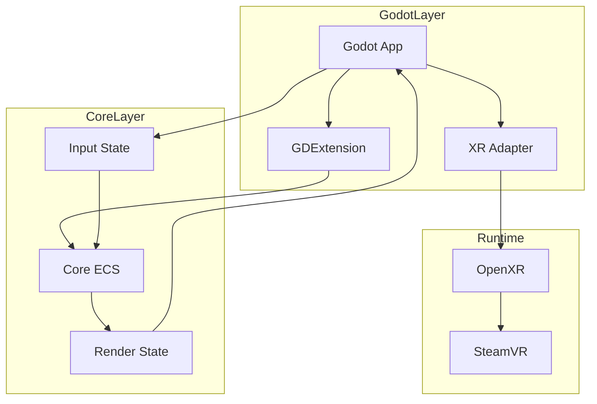
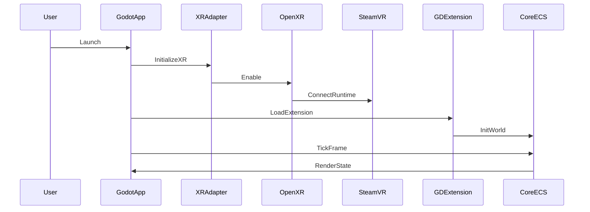

# Technical Design: minimal-godot-client

## Overview
本設計は、Godot Engine と bevy_ecs を組み合わせた最小クライアントを構築し、SteamVR で起動できることを到達点とする。状態の真実は bevy_ecs に集中させ、Godot は描画・入出力に専念させることで、テスト可能性と拡張性を確保する。

本機能は既存の Bloom/Syncer とは独立したクライアント領域の新規追加であり、GDExtension を通じて Godot と Rust の橋渡しを行う。Godot の実行時 API への直接依存を避け、依存性逆転による Port/Adapter 構成を採用する。

### Goals
- SteamVR 上でクライアントが起動し、最小の描画フレームが表示できる
- Godot から bevy_ecs への呼び出しを GDExtension 経由で成立させる
- bevy_ecs が状態の正本となり、Godot は描画/入力に集中する
- Godot 依存を隔離し、Core を純 Rust でテスト可能にする

### Non-Goals
- ネットワーク同期や Bloom/Syncer との統合
- VRChat 互換や高度なワールド/アバター機能
- OpenXR 以外の VR ランタイム対応
- 高度な描画パイプラインや最適化

## Architecture

### Existing Architecture Analysis
既存コードベースにはクライアント実装が存在しないため、本設計は新規追加のクライアント領域に対する構成である。Rust workspace の分離方針と「強い型」「依存性の明示」を踏襲する。

### Architecture Pattern & Boundary Map
**Selected pattern**: Hexagonal (Ports & Adapters)  
**Rationale**: Godot 依存を Adapter に封じ、Core を純 Rust に保つことでテスト容易性を確保する。



**Architecture Integration**
- Domain/feature boundaries: CoreECS が状態の正本、Godot は描画・入力
- Existing patterns preserved: Rust workspace 分割、強い型、ラッパー型非露出
- New components rationale: Adapter 層で Godot API 依存を隔離
- Testability note: Godot クラスの直接操作は実行時依存が強いため、trait による抽象化でテスト可能性を確保
- Steering compliance: 依存方向固定、型安全の維持

### Technology Stack

| Layer | Choice / Version | Role in Feature | Notes |
|-------|------------------|-----------------|-------|
| Client Runtime | Godot Engine 4.x | 3D/VR 実行環境 | GDExtension 対応 |
| Native Extension | GDExtension API | Godot-Rust ブリッジ | Godot minor 互換が必要 |
| Rust Binding | godot-rust (gdext) | Rust 側の Godot API | 公式ドキュメント準拠 |
| ECS | bevy_ecs | 状態管理と更新ループ | 単体利用可能 |
| XR Runtime | OpenXR + SteamVR | VR 起動経路 | Godot 4 でコア統合 |

## System Flows



## Requirements Traceability

| Requirement | Summary | Components | Interfaces | Flows |
|-------------|---------|------------|------------|-------|
| 1.1 | 起動開始 | ClientBootstrap | Service | Startup |
| 1.2 | フレーム更新継続 | CoreECS | Service | Tick |
| 1.3 | 終了処理 | ClientBootstrap | Service | Shutdown |
| 1.4 | 起動失敗通知 | ClientBootstrap | Service | Startup |
| 2.1 | SteamVR 起動 | XRAdapter | Service | Startup |
| 2.2 | SteamVR 未起動通知 | XRAdapter | Service | Startup |
| 2.3 | 最小描画表示 | RenderStateProjector | State | Tick |
| 3.1 | gdext 呼び出し経路 | GodotBridgeAdapter | Service | Startup |
| 3.2 | ECS 呼び出し実行 | GodotBridgeAdapter | Service | Tick |
| 3.3 | ブリッジ初期化失敗通知 | GodotBridgeAdapter | Service | Startup |
| 3.4 | Godot API 呼び出し受付 | GodotBridgeAdapter | Service | Tick |
| 4.1 | ECS World 初期化 | CoreECS | Service | Startup |
| 4.2 | ECS システム実行 | CoreECS | Service | Tick |
| 4.3 | 次フレーム移行 | CoreECS | Service | Tick |
| 5.1 | 状態正本は ECS | CoreECS | State | Tick |
| 5.2 | 状態変更は ECS 経由 | InputCollector | Service | Tick |
| 5.3 | ECS 状態を描画へ反映 | RenderStateProjector | State | Tick |
| 5.4 | 直接書換拒否 | GodotBridgeAdapter | Service | Tick |
| 6.1 | 実行手順ドキュメント | Docs | N/A | N/A |
| 6.2 | 検証手順ドキュメント | Docs | N/A | N/A |
| 6.3 | 手順で最小動作確認 | Docs | N/A | N/A |

## Components and Interfaces

| Component | Domain/Layer | Intent | Req Coverage | Key Dependencies (P0/P1) | Contracts |
|-----------|--------------|--------|--------------|--------------------------|-----------|
| ClientBootstrap | App Shell | 起動/終了と依存初期化 | 1.1, 1.3, 1.4, 2.1, 2.2 | GodotApp (P0), XRAdapter (P0) | Service |
| XRAdapter | Adapter | OpenXR 初期化と SteamVR 接続 | 2.1, 2.2 | OpenXR (P0) | Service |
| GodotBridgeAdapter | Adapter | Godot から ECS へ橋渡し | 3.1, 3.2, 3.3, 3.4, 5.4 | GDExtension (P0), CoreECS (P0) | Service |
| CoreECS | Domain | ECS 状態正本と更新 | 4.1, 4.2, 4.3, 5.1 | bevy_ecs (P0) | Service, State |
| InputCollector | Adapter | Godot 入力を ECS へ | 5.2 | Godot Input (P1) | Service |
| RenderStateProjector | Adapter | ECS 状態を描画へ反映 | 2.3, 5.3 | Godot Render (P1) | State |
| Docs | Docs | 実行/検証手順の明確化 | 6.1, 6.2, 6.3 | N/A | N/A |

### Domain / Core

#### CoreECS

| Field | Detail |
|-------|--------|
| Intent | bevy_ecs を中心に状態の正本を保持する |
| Requirements | 4.1, 4.2, 4.3, 5.1 |

**Responsibilities & Constraints**
- 状態の正本と更新順序の維持
- Godot 依存を持たない純 Rust の境界
- 依存性逆転のための抽象インターフェースのみ公開

**Dependencies**
- Inbound: GodotBridgeAdapter — ECS の操作 (P0)
- Outbound: RenderStateProjector — 状態の投影 (P1)
- External: bevy_ecs — ECS 実装 (P0)

**Contracts**: Service [x] / API [ ] / Event [ ] / Batch [ ] / State [x]

##### Service Interface
```rust
pub struct FrameId(u64);
pub struct Pose(pub [f32; 7]);
pub struct InputSnapshot {
    pub frame: FrameId,
    pub inputs: Vec<InputEvent>,
}
pub struct RenderFrame {
    pub frame: FrameId,
    pub poses: Vec<Pose>,
}

pub trait EcsCore {
    fn init_world(&mut self) -> Result<(), CoreError>;
    fn tick(&mut self, input: InputSnapshot) -> Result<RenderFrame, CoreError>;
}
```
- Preconditions: `init_world` 後に `tick` を呼ぶ
- Postconditions: `tick` は最新の `RenderFrame` を返す
- Invariants: 状態の正本は ECS 内にのみ存在

### Adapters / Godot Integration

#### GodotBridgeAdapter

| Field | Detail |
|-------|--------|
| Intent | Godot から CoreECS への橋渡し |
| Requirements | 3.1, 3.2, 3.3, 3.4, 5.4 |

**Responsibilities & Constraints**
- GDExtension 呼び出しの受け口を提供
- Godot API 依存はこの層に閉じる
- Godot が直接状態を書換する経路を遮断

**Dependencies**
- Inbound: GodotApp — 起動/入力 (P0)
- Outbound: CoreECS — 更新実行 (P0)
- External: GDExtension / godot-rust — API バインディング (P0)

**Contracts**: Service [x] / API [ ] / Event [ ] / Batch [ ] / State [ ]

##### Service Interface
```rust
pub trait GodotBridge {
    fn on_start(&mut self) -> Result<(), BridgeError>;
    fn on_input(&mut self, input: InputSnapshot) -> Result<(), BridgeError>;
    fn on_frame(&mut self) -> Result<RenderFrame, BridgeError>;
}
```
- Preconditions: GDExtension 初期化が完了していること
- Postconditions: CoreECS の更新が反映される
- Invariants: Godot から直接状態を書換しない

#### XRAdapter

| Field | Detail |
|-------|--------|
| Intent | OpenXR を初期化し SteamVR 起動経路を提供 |
| Requirements | 2.1, 2.2 |

**Responsibilities & Constraints**
- XR ランタイムの有効化と初期化結果の通知
- SteamVR 未起動時の明示的な失敗理由提示

**Dependencies**
- Inbound: ClientBootstrap — 起動時呼び出し (P0)
- External: OpenXR — XR ランタイム (P0)

**Contracts**: Service [x] / API [ ] / Event [ ] / Batch [ ] / State [ ]

##### Service Interface
```rust
pub trait XrRuntime {
    fn enable(&mut self) -> Result<(), XrError>;
    fn is_ready(&self) -> bool;
}
```
- Preconditions: Godot の XR 設定が有効
- Postconditions: `is_ready` が true の場合のみ起動継続
- Invariants: SteamVR 未起動時は false を返す

#### RenderStateProjector

| Field | Detail |
|-------|--------|
| Intent | ECS 状態を Godot 描画へ反映 |
| Requirements | 2.3, 5.3 |

**Responsibilities & Constraints**
- RenderFrame を Godot ノードへ投影
- Godot 側は描画専用で状態保持しない

**Dependencies**
- Inbound: CoreECS — RenderFrame (P1)
- External: Godot Scene/Node — 描画対象 (P1)

**Contracts**: Service [ ] / API [ ] / Event [ ] / Batch [ ] / State [x]

### App Shell

#### ClientBootstrap

| Field | Detail |
|-------|--------|
| Intent | 起動/終了の制御と初期化順序の保証 |
| Requirements | 1.1, 1.3, 1.4, 2.1, 2.2 |

**Responsibilities & Constraints**
- GDExtension ロードと XR 初期化順序の保証
- 起動失敗時の理由提示

**Dependencies**
- Inbound: GodotApp — 起動イベント (P0)
- Outbound: XRAdapter, GodotBridgeAdapter — 初期化 (P0)

**Contracts**: Service [x] / API [ ] / Event [ ] / Batch [ ] / State [ ]

##### Service Interface
```rust
pub trait ClientLifecycle {
    fn start(&mut self) -> Result<(), StartError>;
    fn shutdown(&mut self) -> Result<(), ShutdownError>;
}
```
- Preconditions: 必要な依存が注入済み
- Postconditions: 成功時はフレームループ開始
- Invariants: 失敗時は明確な理由を返す

## Data Models

### Domain Model
- **Entity**: Player, Controller
- **Value Objects**: Pose, FrameId, InputSnapshot
- **Invariants**: 状態の正本は ECS にのみ存在し、Godot 側は投影のみ

### Logical Data Model
**Structure Definition**
- InputSnapshot: フレーム単位の入力集合
- RenderFrame: 描画に必要な最小状態
**Consistency & Integrity**
- フレーム単位での一貫性を維持
- 描画状態は毎フレーム ECS から生成

## Error Handling

### Error Strategy
- 起動フェーズでの失敗は即時停止し、原因を通知
- 実行中エラーはフレームを停止せず、状態を安全側に保つ

### Error Categories and Responses
- **User Errors**: SteamVR 未起動 → 明示的理由提示
- **System Errors**: GDExtension 初期化失敗 → 起動停止
- **Business Logic Errors**: 状態直接変更要求 → 拒否し理由通知

### Monitoring
- tracing による構造化ログ
- 起動失敗理由・XR 初期化結果の記録

## Testing Strategy

### Unit Tests
- CoreECS の World 初期化と tick の更新
- 入力から状態更新への変換
- RenderFrame 生成の整合性

### Integration Tests
- GodotBridgeAdapter と CoreECS の契約検証
- XRAdapter の起動/未起動判定
- SteamVR 起動時の最小描画確認（要環境）

### E2E/UI Tests
- SteamVR 上での起動と描画確認

## Performance & Scalability
- 1 フレーム内で ECS 更新と描画投影が完結すること
- 入力/描画の変換を最小化しフレーム時間を抑制

## Supporting References
詳細な調査根拠は `research.md` を参照。
